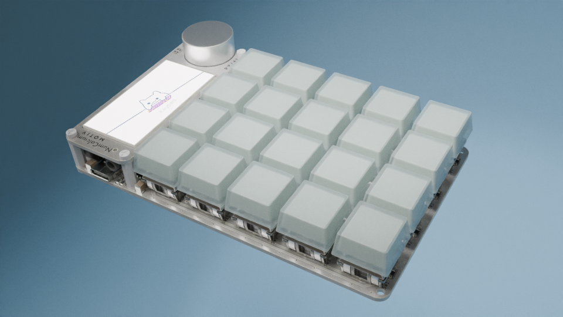
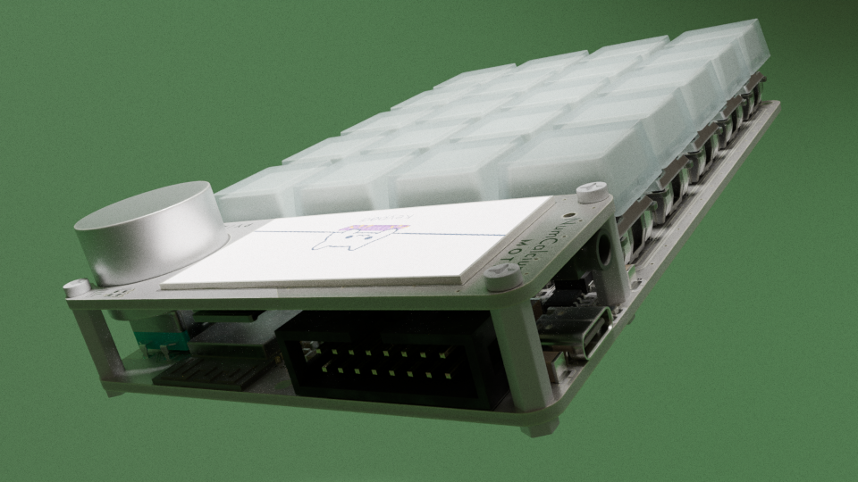

# NumCalcium



NumCalcium is a calculator-like USB + Bluetooth Numpad keyboard. This is the primary intended function, however, because it is powered by MicroPython, users are able to write their own programs for it.
There were a number of different hardware and software revision before I settled on a combination of an ESP32 S3 and MicroPython. It made so much sense for the applications that I wanted to achieve, and was far easier to get working than my previous attempts with STM32F103 and a custom system in C, more about the development history below if you're interested :)

## Installation

You can download the release binary and flash it using esptool.py or other compatible ESP32 flashing tools.
You can also build the sources and / or change any config here to suit your needs, then flash the resulting binary.

The recommended method is to use the Makefile in this repo, which in turn uses `Docker` to pull the specific `esp-idf` version to build `MicroPython` against.

Hold down the encoder button (ESP32 GP0 pin) and reset the device, then:

```bash
make gen-ulp all deploy
```


## Hardware



The hardware contains an ESP32 S3 module with integrated PSRAM, a color LCD (320*170 px, ST7789), a rotary encoder, 20 mechanical switch buttons, SD card slot, USB (2.0) C port, Headphone jack, a buzzer, and exposed GPIO using an IDC connector.

### Pinout
The IDC connector can be used to plug in external hardware in three ways:
- using jumper wires onto a breadboard
- using a dedicated IDC cable 
- using the port to plug in custom PCBs

The last option is encouraged to develop standalone daughter boards with your custom hardware, including driver code, which can be stored on a flash chip located on the daughter board, and have NumCalcium read it and execute the code!

```
BACK VIEW - TOP

                TOP OF IDC CONNECTOR
[GND,   VBAT,   SDA/TX1, SCL/RX1, TX0,  RX0, GND, VCC]
[GP8,   GP7,    GP6,     GP5,     GP4,  GP3, GP2, GP1]

BACK VIEW - BOTTOM OF BOARD
```

The rotary encoder button is connected to GP0, which allows entering flash mode for firmware updates. The button is also monitored and treated separately from the keys as this button is intended to return to the main app switcher, [described in detail on its own repo.](https://github.com/purewack/numcalcium-apps.git)

The device has a built in li-ion battery charger and voltage regulator, so you can power the whole unit off a 18650 cell, and charge it while using it. The regulator + charger combo has been configured in such a way to provide enough current for charging and system demands.

There is an additional low power regulator designed to be always on, to keep the ESP32 powered during deep-sleep. The ESP32 can control the main regulator and turn it off to power down all other components on the board, except itself. By doing this, the board can have peripherals plugged in to the IDC port, but they will not drain the battery, as the regulator will disable VCC and another transistor will cut VBAT to the IDC port, which normally would be connected directly to the 18650 cell.

<ins>**Warning:**</ins>

The VBAT, as mentioned above, is connected to the positive terminal of the 18650 battery cell through a MOSFET, no other protection is provided from shorting the pin to ground, so caution must be taken as these cells can discharge a lot of current at once very quickly, most likely damaging the transistor before any real harm is done elsewhere, regardless caution is to be taken when operating near this pin!

The headphone jack is connected to the ESP32 via stereo RC filters, for crude PDM audio, which is experimental as the performance hit of the MicroPython interpreter has an impact on the scheduling of audio buffers at the time of writing.

The buzzer is a piezo element which can be used for 'beeps and boops' for feedback purposes when writing your own apps. Its also quite good at playing chiptunes ;)

The SD card slot and LCD screen are on the same SPI bus so it is advised to write code around this limitation in mind, avoiding using threads to address the screen and card at the same time to avoid data corruption and unwanted side effects.

The LCD is connected to SPI3 Bus, leaving SPI2 available to users on the IDC port.

The IDC port exposes two UART pairs, and I2C pins on the same pins which are used by 'cartridge' PCB featuring flash chips with driver code, allowing the board to setup the pins and further communication as needed.
The RX0 TX0 pair is permanently mapped to output `stdout` for developing applications which use USB, allowing users to still see debugging output on their console using UART converters.

There are addressable LEDs under each key and on the front next to the LCD. with give more options for UI UX design by for example highlighting keys that do something in a certain mode.

## Software


The main module which bundles all new and useful functionality compared to base MicroPython is `numcalc`.

This module contains classes making setting up common operations and pin assignments easier, specifically:
- interacting with the LCD
- LCD backlight adjustment
- a class specifically configuring the SD card slot
- buzzer tone control, 
- keypad input reading
- encoder turns and clicks
- LED control by obfuscating the neopixel class setup
- cartridge code loading and burning
- headphone PDM buffered audio streaming
- lcd BMP image parsing, framebuffer ready

> [class LCD() docs](docs/lcd.md)

> [class Keys() docs](docs/keys.md)

> [other `numcalc` functions docs](docs/other.md)

## Build and development

- Build and flash main firmware:

        make all
        make deploy

- Build and flash firmware with no modules, just c drivers:

        make firmware-no-freeze
        make deploy-no-freeze

- Build ULP code:

        make gen-ulp

- Build font file:
        make gen-font

- Update pin definitions:
        make gen-pins

# Devlog

I have included a development history going back through different [hardware designs and software paradigms.](devlog/HISTORY.md)

