# History

### Version 1

The first version for hardware and software was an STM32F103 core with a basic LCD in monochrome at 128x64 pixels. The STM32 was a good first candidate as it was cheap and relatively simple to just start writing some C code in the Arduino IDE. I wrote quite a few different apps and even a transistor latching power switch using the encoder switch turning on a MOSFET to provide power to the chip, which then could be turned off from software level by 'choking' the MOSFET gate (sometimes it could fail though, leaving the board in a wierd state)

Keyscanning was inspired by how (i think) the Nintendo DS did it, at least in software, meaning the key values for down and up presses of each key are stored as bits in two long binary numbers. The bits keep their state until the software that needs to read their state clears them, giving us buffered key input in a sense.

The STM32 did this here using interrupts and scanning each row on every interrupt, giving users access to the buffered key registers for use in the programs without actually reading or scanning the keys states manually.

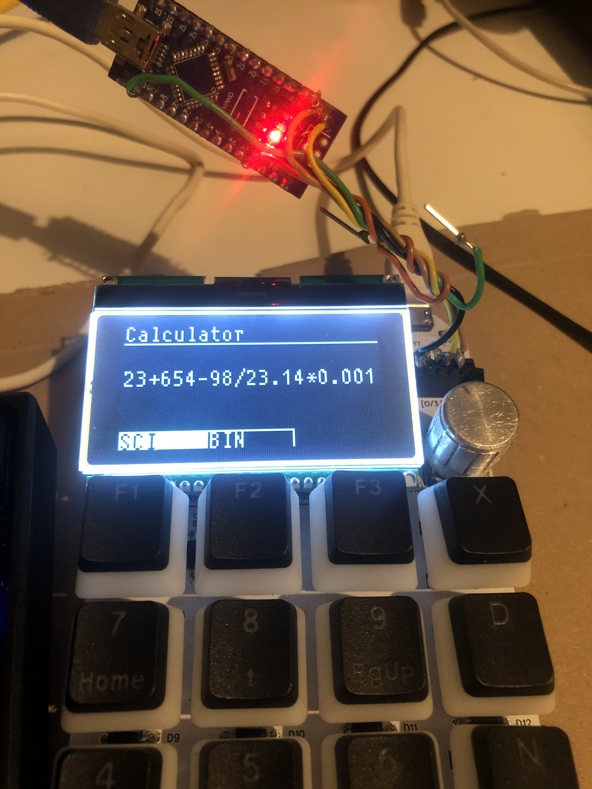

As you can see, the times were rough and I had to develop this using an old arduino nano clone which I had previously shorted, so the chip is gone and I used the UART converter from this board to program the STM32 :/

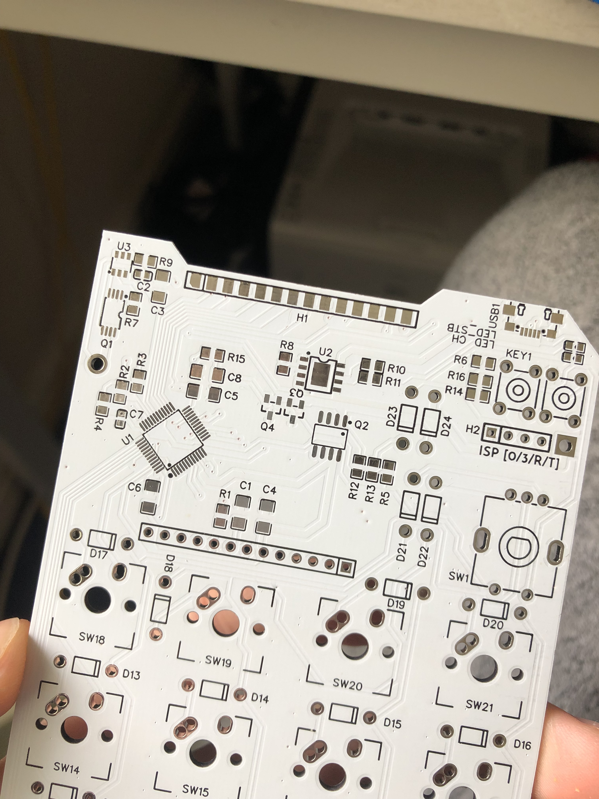
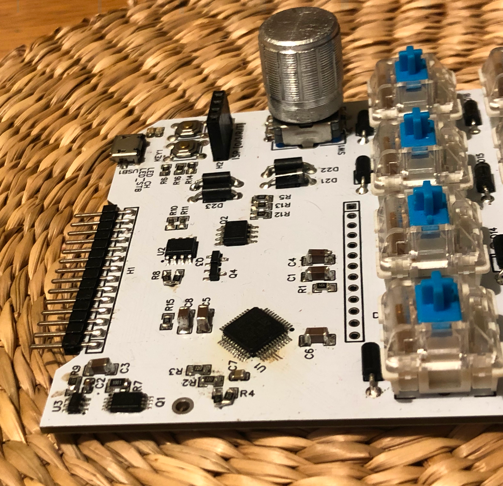

### Version 2

The next version was on the same core as I had ambitions to keep the cost down to make it easier for DIY enthusiasts assembling their own boards. This time however I designed the board with more ideas revolving around making it easier to execute custom external code.

I has some success in doing this but the process was not very user friendly and I had fallen into a deep rabbit hole of trying to develop my own linker script to allow the external code to reference functions found in the flash, resembling something close to static linking against the binary found on the chip. This was a partial success, and partial because the memory limitations kicked in quick given the 64k flash space I had on this specific target chip.

I felt like upgrading to a beefier STM32 variant would be the way to go, but at this time esp8266 was really kicking off so I was exploring that for some time, but eventually dismissed it for not having native USB, something I felt was crucial for a device that is to behave like a keypad. 

I had actually abandoned the project for some time due to not being knowledgeable enough to know how to tie all these knots into one string, to form a device that is both user customizable and at the same time user friendly.

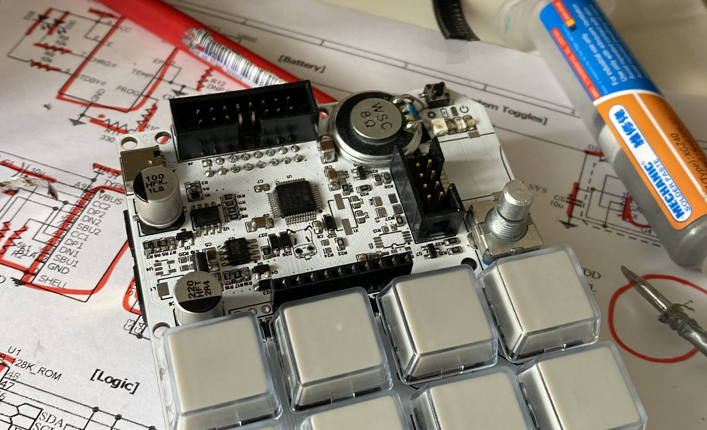

The board layout has become significantly more cramped since the last revision as I have included a lot more exposed IO inline with the new philosophy of user executable code and customization. I also added an SD card slot which later turned out could not be used at the same time as the GPIO on the ports as they shared the same pins, yet another reason to consider a different chip / design.

### Version 3

This is the first design with an ESP32 as I decided at this time that I do not need a USB really, I could do with just bluetooth, which the ESP32 had. 

At this time I also started leaning into MicroPython more and decided that I can experiment if this is possible at all either by writing esp-idf code or trying to get MicroPython to run with the key scanning interrupt hack.

This board however never made it into prototyping stage and was instead stuck in layout hell. I was trying to accommodate the cartridge pinout, a new color LCD and wifi/bluetooth antenna layout guides which recommended leaving some unpopulated space around the antenna.

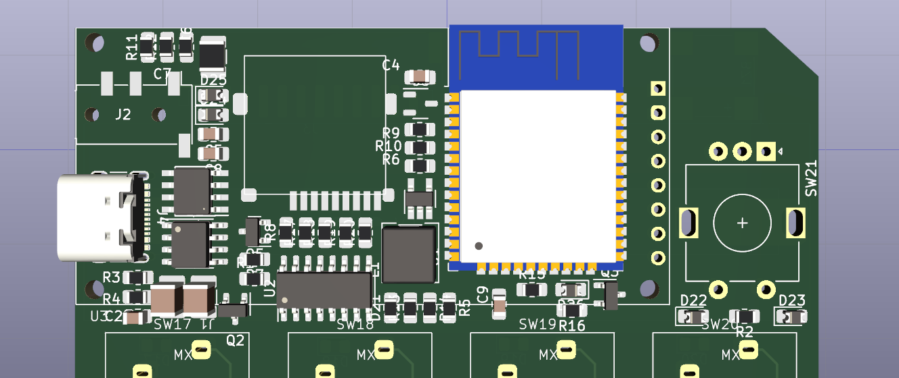
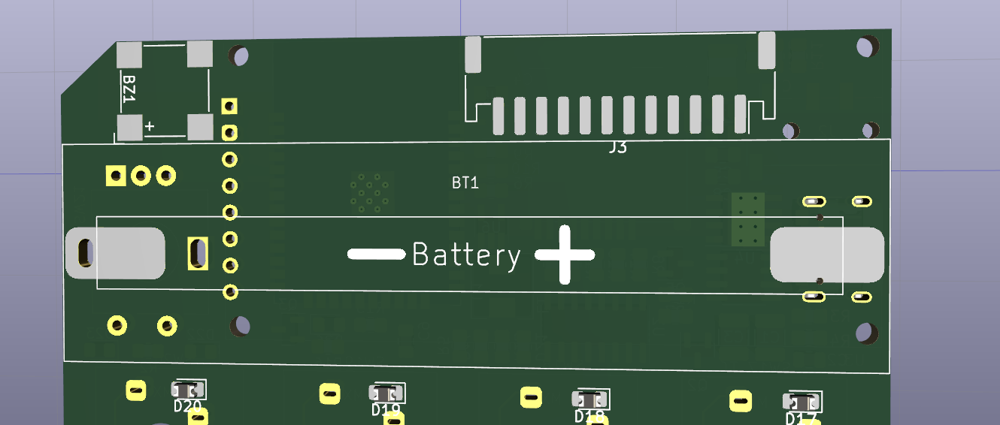

The battery connector was the biggest obstacle because the screen assembly is attached using hex standoffs, so either an odd number of standoffs was to be used, or the pcb had to be elongated, leaving the layout kind of ugly.

I also really wanted to add a headphone jack to test some audio programs, which left even less space.

### Version 4

This is the pivoting point as I had come back to this project so many times that looking at it made me want to throw it away each time I sat down to think about it.

The introduction of the ESP32 S3 improved almost everything about the chip and solved many of my layou problems and the previous version suffered from peripherals sharing many of the same pins which could not me changed, especially for the screen. 

With this version I was able to design the board like I wanted it to be from the beginning: no other thinking parts except the main core, meaning there was to be no other co processor on the board that would handle graphics, io etc. The ESP32 was to perform all these tasks. This was possible now because a lot of the S3 modules had build in PSRAM and the ULP could be coded in C, speeding up the debugging process significantly.

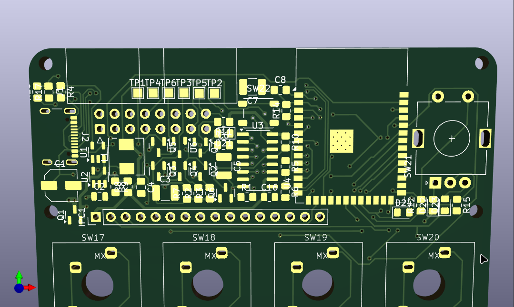

I also wanted the board to be two layers only to keep costs down. This proved to be a massive challenge in the layout process because I ran into thin ground traces multiple times and had to reroute my way to run the battery negative close to the regulator and other peripherals.

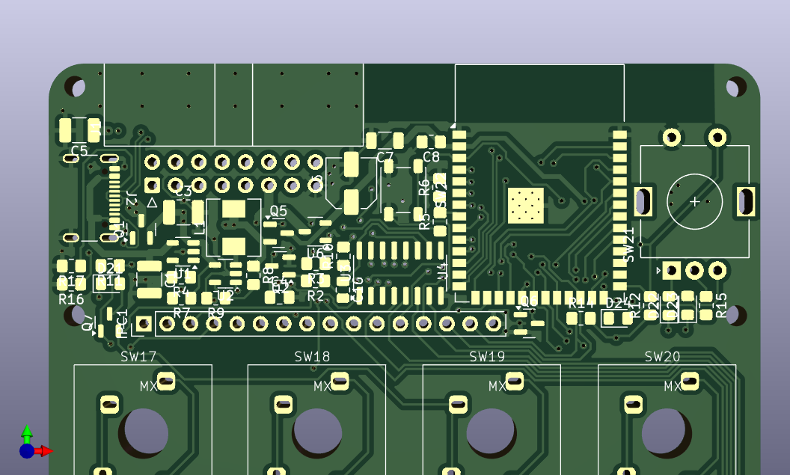

This first few layout had some bugs that I had to bodge in post when I found out the hard way that I used the wrong footprint for the transistors that I *didn't* have :/
I also found out that my low power circuit powered down the board only to then come back up again, leaving the device on all the time unless the battery was out.

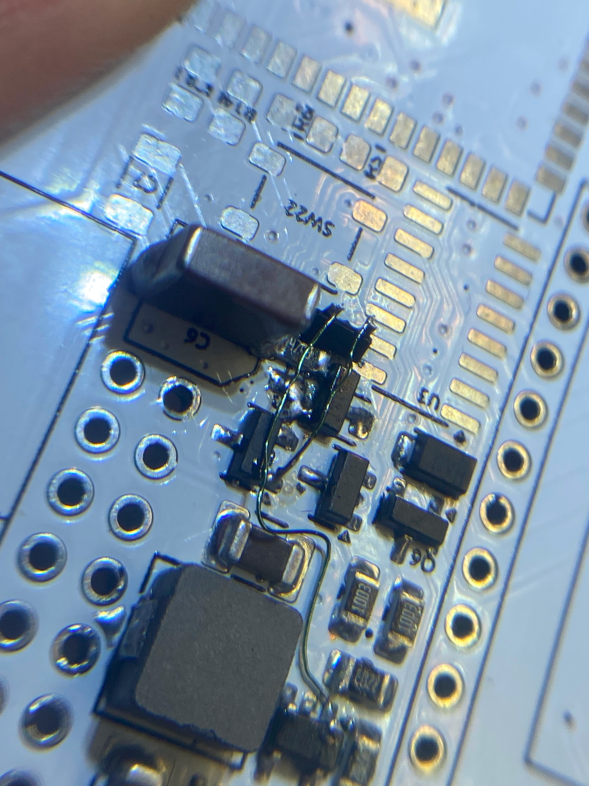

I experimented with pogo pins for the top screen assembly also but this turned out to be a not so great idea, both for debugging and for reliablilty, as the long line of pins bowed the board making the middle contacts not connect properly at times, or during shock when setting the board down on a table.

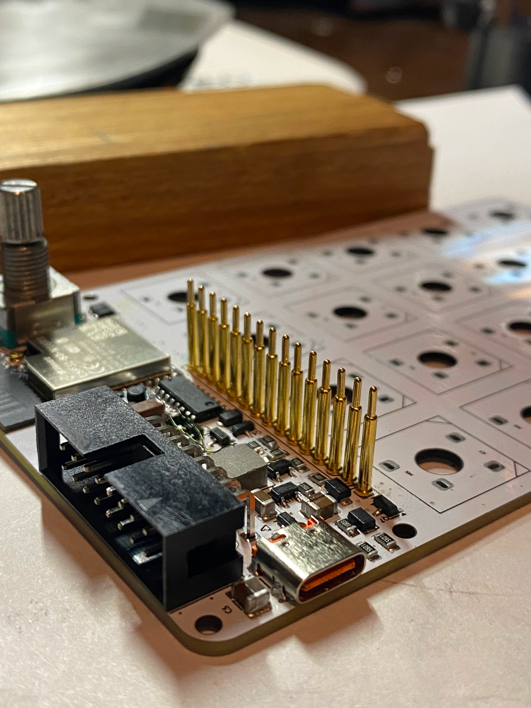
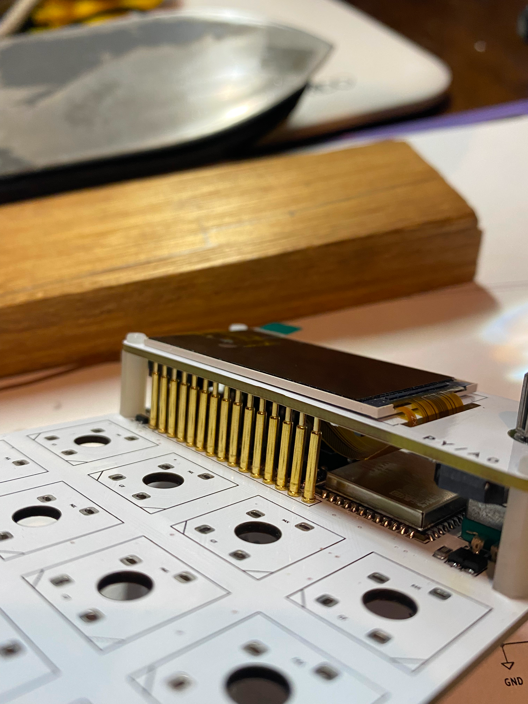
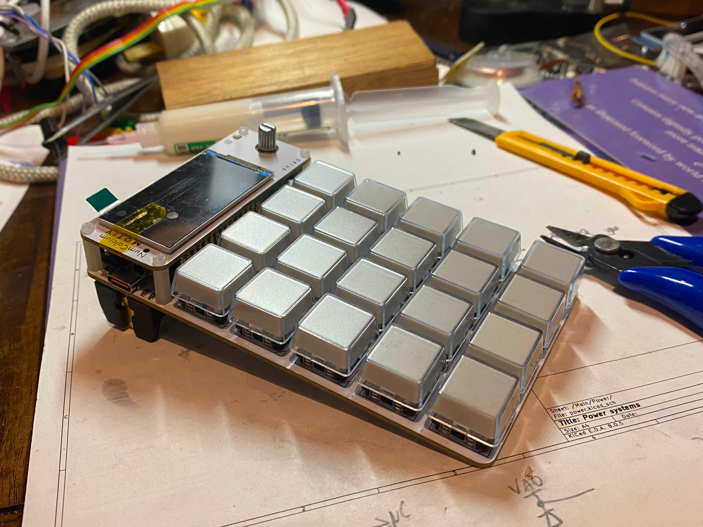

At one point I wanted the device to be able to work like a full computer close to what you would use in the 80s, where a terminal would accept BASIC code.

It looks like its not possible to inject keystrokes into the `stdin` of MicroPython easily, so I was only stuck with the terminal output on the screen and no way to input characters without a host computer.

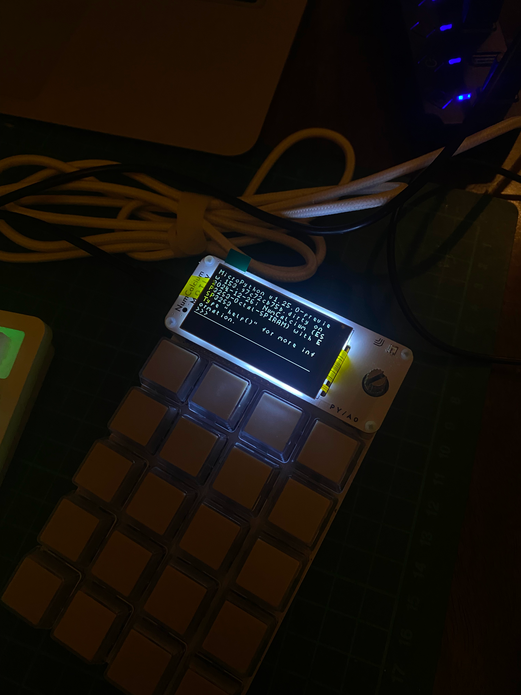

### Version 5

This is the current version which addressed almost all my concerns and issues in terms of hardware bug. 

The look is the same like in version 4 with the most notable change being the encoder design being streamlined to allow turing it from the side like a volume wheel.

It features a flat flex cable to connect the screen board to the main board, addressable LED under each key, and a buzzer and headphone jack which I wanted since version 1.

This is pretty much now the definite design as I cant see what could be improved, also there is little room left anyway and its tight enough to fix any cold solder joints by hand as it is.

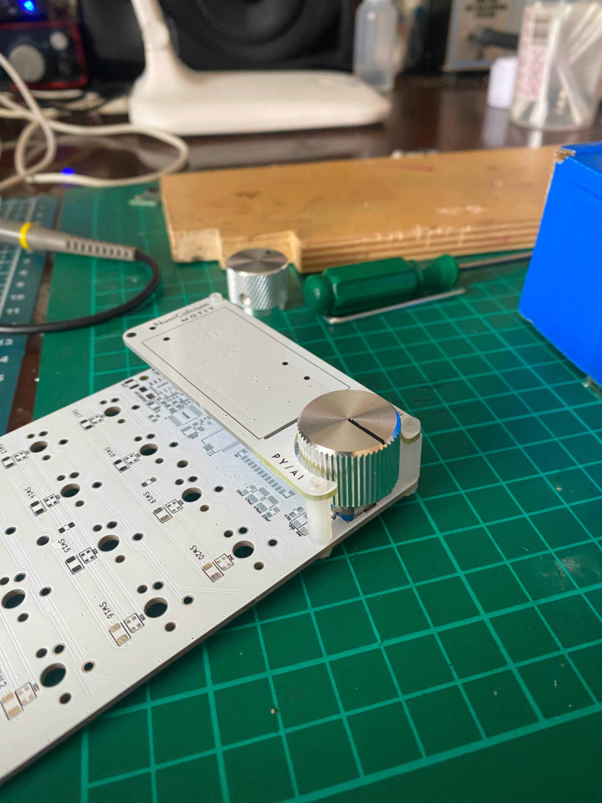
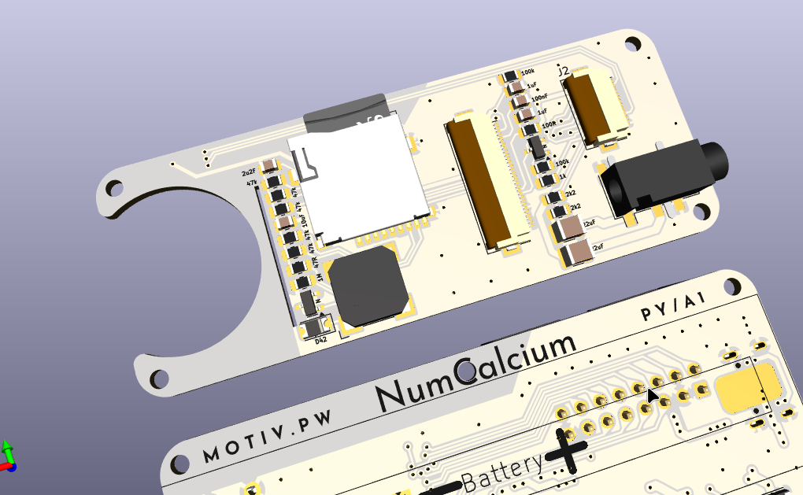

The silkscreen is laid out to allow hand assembly without referencing a schematic, simply showing component values instead of designators.
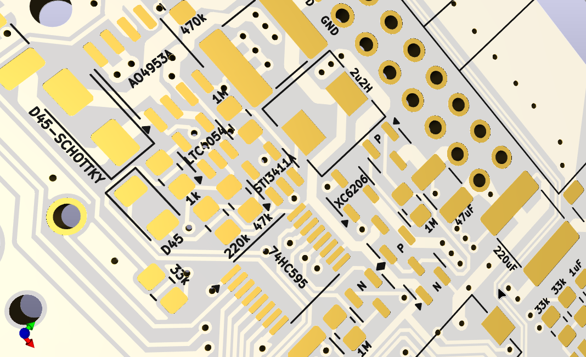

